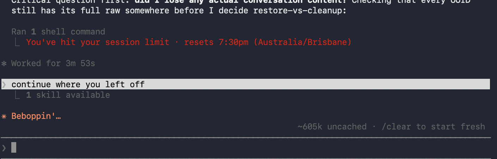
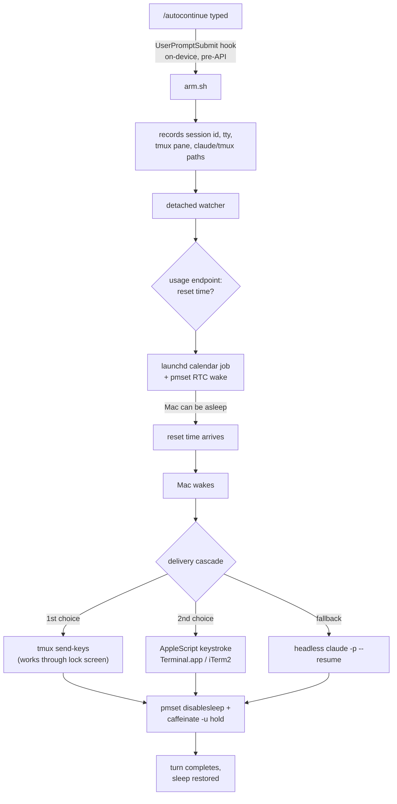

<div align="center">

# claude-autocontinue

**Hit your Claude Code rate limit, walk away — and have your session pick itself back up the instant your usage resets.**

Even if the Mac is asleep. Even if the lid is closed. Even if it's locked and on battery.

[](#requirements)
[](#how-it-works)
[](LICENSE)
[](#requirements)
[](#how-it-works)

</div>

<p align="center">
  
  <br>
  <sub>A real fire, unedited: the session limit hits, then autocontinue types and submits "continue where you left off" on its own.</sub>
</p>

---

## What it does

Type `/autocontinue` in any Claude Code session and walk away. When your usage window resets, autocontinue:

1. **Wakes your Mac** if it's asleep (hardware RTC timer — works lid-closed, on battery)
2. **Types `continue where you left off`** into that exact session and presses Enter — even through a locked screen
3. **Holds the Mac awake** while Claude actually does the work
4. Lets everything go back to sleep, cleanly, with nothing left running

No AI is involved in arming it. `/autocontinue` is intercepted **on your device, before it ever reaches the API** — which is exactly why it works even while you're actively rate-limited and Claude can't respond to anything. It never touches the Claude Code installation itself, so it survives every update.

## Install

```bash
curl -fsSL https://raw.githubusercontent.com/QFSBOY/claude-autocontinue/master/install.sh | bash
```

The installer runs a preflight check (macOS, Claude Code version, python3, your `claude` binary, Keychain login, tmux) before touching anything, and safely merges into your existing `settings.json` — your other hooks are left untouched.

**Restart Claude Code** afterward (hooks load at startup).

Optional, recommended — lets it wake a sleeping Mac at the exact moment your usage resets:

```bash
bash ~/.claude/autocontinue/setup-wake.sh
```

One password prompt, installs four narrowly-scoped `pmset` sudoers rules. Nothing else. See [Security](#security).

## Usage

| Command | Effect |
|---|---|
| `/autocontinue` | Arm this session — auto-continues at the next usage reset |
| `/autocontinue status` | Show armed state, other sessions, recent log |
| `/autocontinue off` | Disarm this session |
| `/autocontinue test 30` | Full end-to-end rehearsal — fires in 30 seconds |

Arm as many concurrent sessions as you like. Each gets its own independent watcher and exactly one continue message — they never interfere with each other.

## How it works



1. **Arm** — the `UserPromptSubmit` hook catches `/autocontinue` before it reaches the API, records the session's identity, and detaches a watcher process.
2. **Watch** — the watcher reads your real usage state from Anthropic's own OAuth usage endpoint (your Keychain token, no guessing): current %, the 5-hour window reset time, *and* weekly limits. If a weekly limit is maxed, it correctly waits for the weekly reset instead of firing uselessly into a still-blocked session.
3. **Wake** — a `launchd` calendar job plus a `pmset` hardware wake fire at reset time. The hardware wake works lid-closed, on battery, fully asleep.
4. **Deliver** — first path that works wins, exactly once, via an atomic claim so a backup and primary watcher can never double-fire:
   - **tmux `send-keys`** — injects at the pty layer, the *only* method that works through a locked screen
   - **AppleScript keystroke** — into the exact Terminal.app tab or iTerm2 session that owns the armed tty
   - **headless `claude -p --resume`** — continues the same session transcript in the background if neither of the above is possible
5. **Hold** — keeps the Mac awake while the turn actually runs (`pmset disablesleep` defeats clamshell sleep; `caffeinate -u` avoids DarkWake throttling). Minimum 7 minutes, extends while Claude is visibly working, releases automatically, always restores normal sleep behavior afterward.

## Requirements

| | |
|---|---|
| OS | macOS (uses `launchd`, `pmset`, `osascript`, Keychain) |
| Claude Code | ≥ 1.0.62 (`UserPromptSubmit` hook support) |
| python3 | Ships with Xcode Command Line Tools |
| Login | Claude Code logged in via claude.ai subscription (API-key setups still work, degraded to polling) |
| Recommended | [`tmux`](https://github.com/tmux/tmux) — the only delivery path that survives a locked screen |

Works identically on Apple Silicon and Intel. Finds `claude` wherever it lives — Homebrew, npm-global, `~/.local/bin`, nvm, volta — by resolving it in your real shell `PATH` at arm time, not launchd's stripped-down one.

## Honest limitations

- **Locked screen, no tmux** → GUI keystrokes are architecturally impossible at the macOS lock screen. Falls back to headless resume; you review the result later with `claude --resume`.
- **Sleeping Mac, no `setup-wake.sh`** → nothing can wake real hardware without it; delivery happens on your next manual wake instead of exactly on time.
- **Fires at the reset regardless of whether you actually hit the limit** — usage-reset-driven by design, not limit-driven. `/autocontinue off` if that's not what you want for a given session.
- Extremely long unattended turns triggered from a battery-powered DarkWake are less thoroughly tested than the AC-power path.

## Security

- The sudoers drop-in (`setup-wake.sh`) grants exactly four commands — `pmset schedule wake`, `pmset schedule cancelall`, `pmset -a disablesleep 1`, `pmset -a disablesleep 0` — nothing broader, validated with `visudo -c` before install. Remove anytime: `sudo rm /etc/sudoers.d/claude-autocontinue-pmset`.
- Your OAuth token is read from your own Keychain at runtime and sent only to `api.anthropic.com` — the same endpoint the official Claude Code CLI uses. Never stored, never logged.
- Keystrokes are sent only to the specific terminal tab or tmux pane that owns the armed session's tty. Never blind input into whatever's frontmost.

## Uninstall

```bash
bash ~/.claude/autocontinue/uninstall.sh
```

Stops all watchers, restores sleep settings, removes launchd jobs, removes the hook from `settings.json`, deletes all files, and (with one password prompt) removes the sudoers rule.

## FAQ

**Does this send my prompts anywhere?**
No. `/autocontinue` never reaches the API — it's blocked and handled entirely on your machine. The only network call the watcher makes is to Anthropic's usage endpoint, authenticated with your own existing Keychain credentials.

**Will it fight with other Claude Code hooks or plugins?**
No. The installer only *appends* to your `UserPromptSubmit` hooks array — existing hooks (yours or a plugin's) are left exactly as they were.

**What if I don't use tmux?**
Everything still works while your Mac is unlocked. A locked screen falls back to continuing the session in the background — you just can't watch it live through the lock without tmux.

**Why does it fire even if I never hit the limit?**
By design — "continue where you left off" makes sense at your usage reset whether you were blocked or just paused. Disarm a session anytime with `/autocontinue off`.

## Contributing

Issues and PRs welcome — see [CONTRIBUTING.md](CONTRIBUTING.md).

## License

[MIT](LICENSE)
